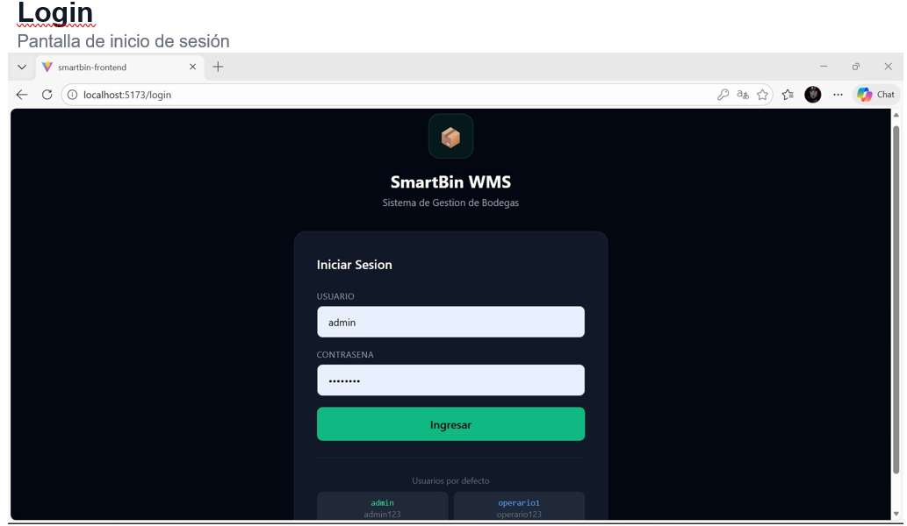
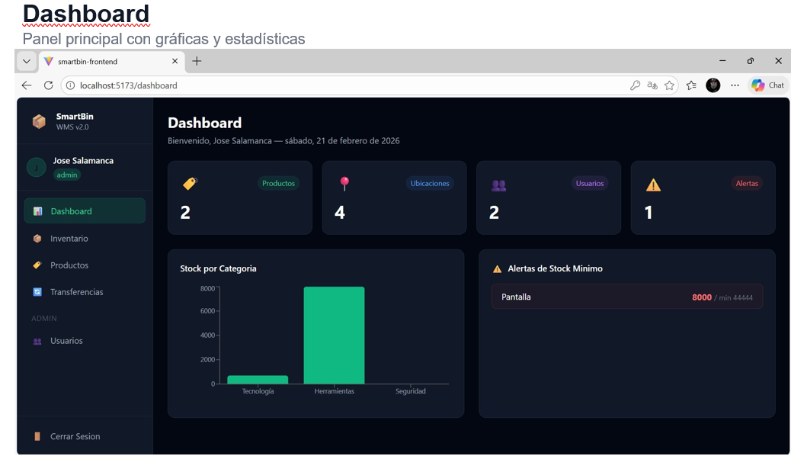
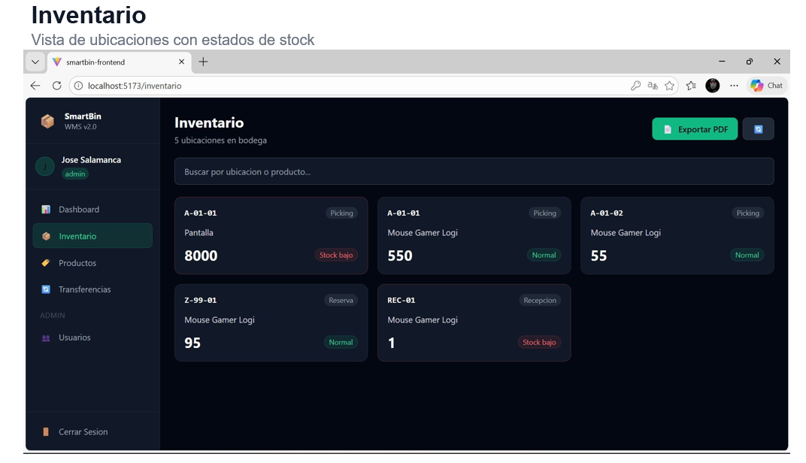
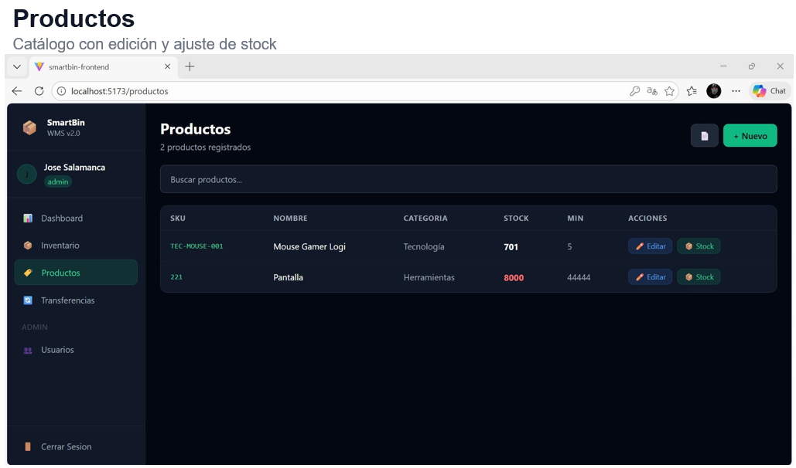
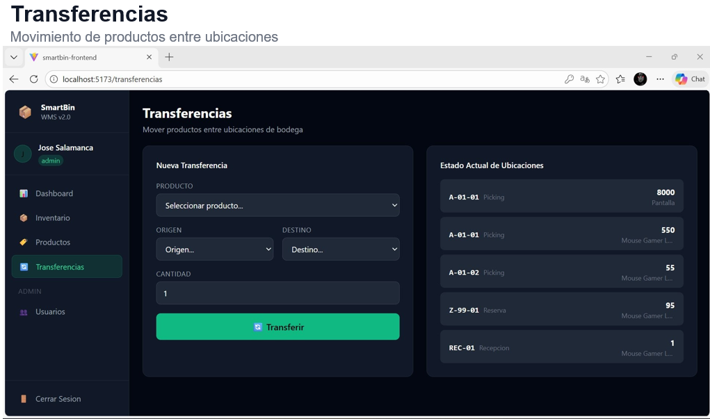
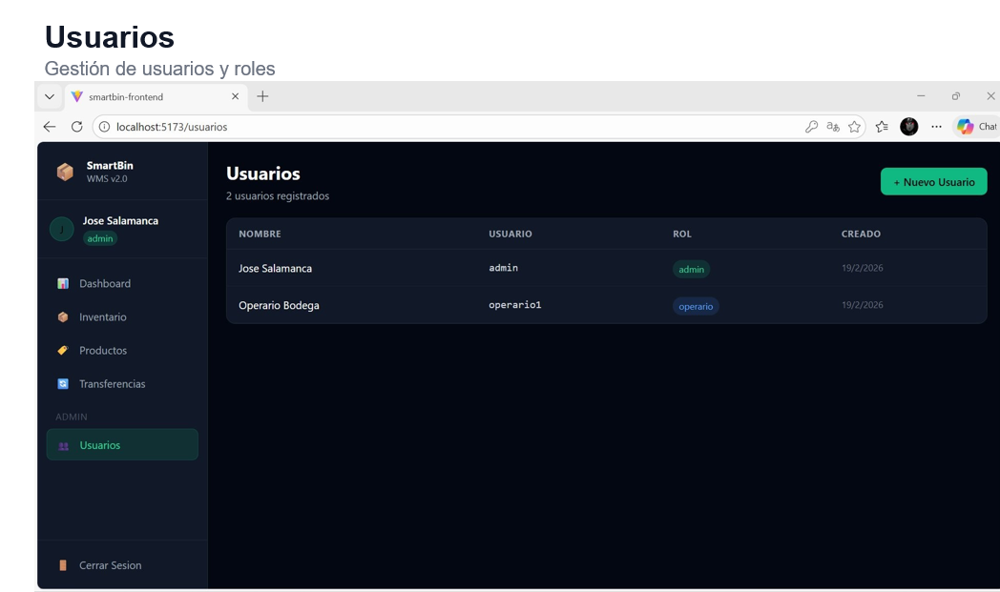
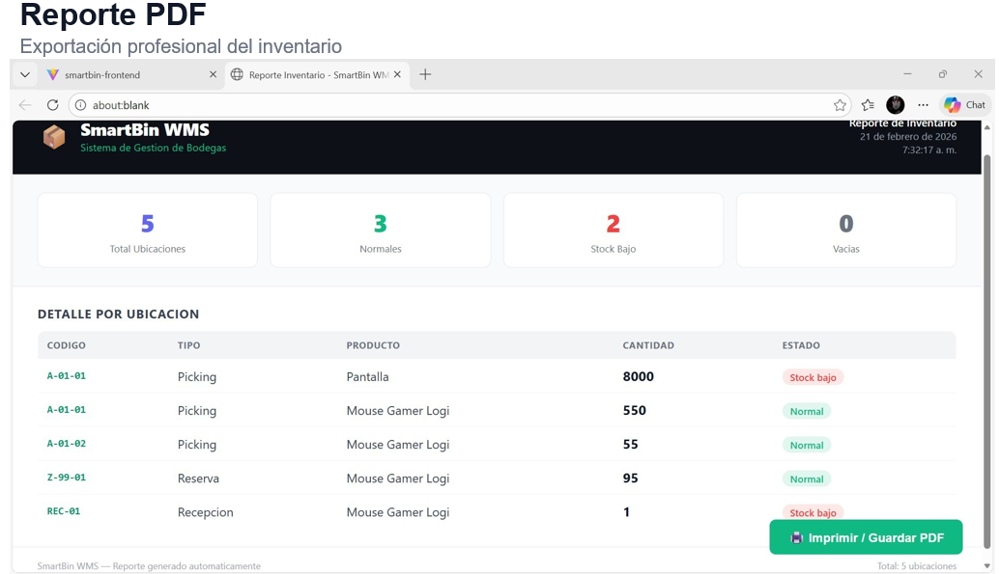

# 📦 SmartBin WMS
> Sistema de Gestión de Bodegas (Warehouse Management System)

Aplicación web completa para gestionar inventario, productos, ubicaciones y usuarios de bodega. Desarrollada con **FastAPI** en el backend y **React** en el frontend, con autenticación JWT y roles de usuario.

---

## 🖼️ Capturas del Sistema

### Login


### Dashboard


### Inventario


### Productos


### Transferencias


### Usuarios


### Reporte PDF


---

## ✅ Funcionalidades

- 🔐 **Autenticación JWT** con roles (admin / operario)
- 📊 **Dashboard** con gráficas de stock por categoría y alertas en tiempo real
- 📦 **Inventario** — tarjetas por ubicación con estados (Normal / Stock bajo / Vacío)
- 🏷️ **Productos** — crear, editar y ajustar stock desde el panel
- 🔄 **Transferencias** — mover productos entre ubicaciones de bodega
- 👥 **Usuarios** — gestión de usuarios con roles (solo admin)
- 📄 **Reportes en PDF** — exportar inventario y catálogo de productos
- 📱 **Responsive** — funciona en mobile con menú hamburguesa

---

## 🛠️ Stack Tecnológico

| Capa | Tecnología |
|------|-----------|
| Backend | Python 3.13 + FastAPI |
| Base de datos | MySQL 8.0 |
| Autenticación | JWT (PyJWT) + SHA256 |
| Frontend | React 18 + Vite |
| Estilos | Tailwind CSS |
| HTTP Client | Axios |
| Rutas | React Router DOM |
| Gráficas | Recharts |

---

## 🚀 Instalación Local

### Requisitos previos
- Python 3.10+
- Node.js 18+
- MySQL 8.0

### 1. Clonar el repositorio
```bash
git clone https://github.com/KeLeBrA99/SmartBin-WMS.git
cd SmartBin-WMS
```

### 2. Configurar la base de datos
```sql
CREATE DATABASE smartbin_wms;
USE smartbin_wms;
-- Ejecutar el archivo de migración SQL
```

### 3. Iniciar el backend
```bash
cd SmartBin_WMS
pip install fastapi uvicorn mysql-connector-python pyjwt
python -m uvicorn main:app --reload
```

El backend queda disponible en `http://localhost:8000`  
Documentación automática en `http://localhost:8000/docs`

### 4. Iniciar el frontend
```bash
cd smartbin-frontend
npm install
npm run dev
```

Abrir `http://localhost:5173`

---

## 👤 Usuarios por defecto

| Usuario | Contraseña | Rol |
|---------|-----------|-----|
| admin | admin123 | Administrador |
| operario1 | operario123 | Operario |

---

## 📁 Estructura del Proyecto

```
SmartBin_Completo/
├── SmartBin_WMS/                # Backend
│   ├── main.py                  # API FastAPI con todos los endpoints
│   └── poblar_bd.py             # Script para poblar la base de datos
├── smartbin-frontend/           # Frontend
│   └── src/
│       ├── context/
│       │   └── AuthContext.jsx  # Manejo de sesión JWT
│       ├── pages/
│       │   ├── Login.jsx
│       │   ├── Dashboard.jsx
│       │   ├── Inventario.jsx
│       │   ├── Productos.jsx
│       │   ├── Transferencias.jsx
│       │   └── Usuarios.jsx
│       ├── components/
│       │   ├── Sidebar.jsx
│       │   ├── Layout.jsx
│       │   └── ProtectedRoute.jsx
│       └── api.js               # Configuración Axios
└── screenshots/                 # Capturas del sistema
```

---

## 🔌 API Endpoints

| Método | Ruta | Descripción | Auth |
|--------|------|-------------|------|
| POST | `/login` | Iniciar sesión | No |
| GET | `/dashboard` | Estadísticas generales | Sí |
| GET | `/productos` | Listar productos | Sí |
| POST | `/productos` | Crear producto | Sí |
| PUT | `/productos/{id}` | Editar producto | Admin |
| PATCH | `/productos/{id}/stock` | Ajustar stock | Admin |
| GET | `/ubicaciones` | Ver inventario por ubicación | Sí |
| POST | `/transferencias` | Transferir stock | Sí |
| GET | `/usuarios` | Listar usuarios | Admin |
| POST | `/usuarios` | Crear usuario | Admin |

---

## 💡 Contexto del Proyecto

Este sistema nació de la experiencia trabajando como **Auxiliar de Bodega en Lo Basico SAS**, donde se identificó la necesidad de digitalizar el control de inventario que se manejaba manualmente. SmartBin WMS resuelve ese problema con una interfaz moderna, accesible desde cualquier dispositivo.

---

## 👨‍💻 Autor

**Jose Armando Salamanca**
- 📧 t4hkelebra1@gmail.com
- 🐙 [@KeLeBrA99](https://github.com/KeLeBrA99)
- 💼 Estudiante de Ingeniería de Software — Politécnico Grancolombiano
